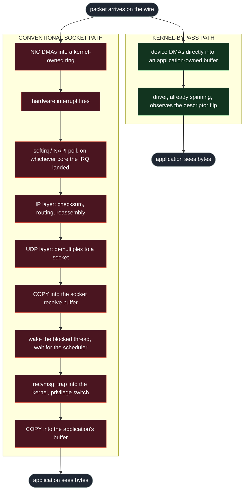
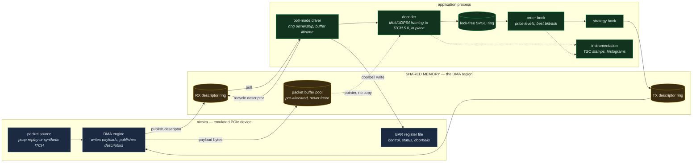
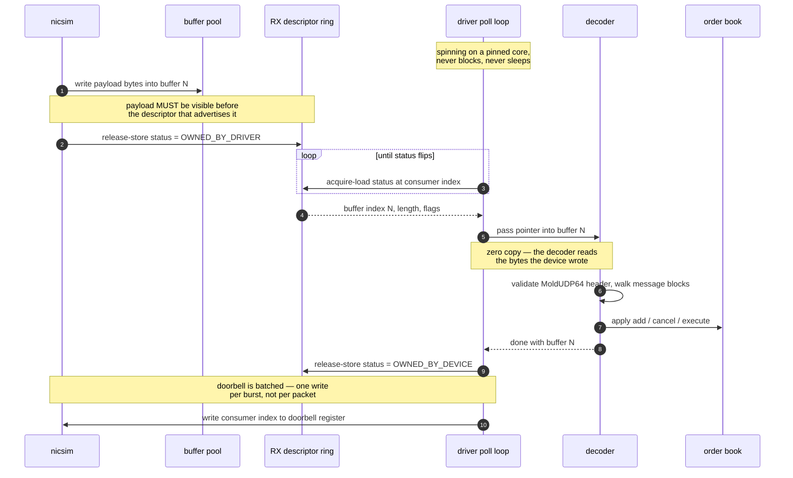

# Ultra-Low-Latency Kernel-Bypass Feed Handler

A kernel-bypass market data pipeline in C++20: an emulated PCIe NIC, a poll-mode
user-space driver, a zero-copy ITCH 5.0 decoder, and a price-level order book —
with every latency claim measured rather than asserted.

The receive path performs no allocation, no copy, and no syscall.

***

## Table of contents

* [What this is](#what-this-is)

* [Why latency is worth money](#why-latency-is-worth-money)

* [Where the microseconds actually go](#where-the-microseconds-actually-go)

* [What kernel bypass changes](#what-kernel-bypass-changes)

* [The emulation trade](#the-emulation-trade)

* **[Architecture](#architecture)**

  * [1. The two receive paths](#1-the-two-receive-paths)

  * [2. System decomposition](#2-system-decomposition)

  * [3. The RX hot path, step by step](#3-the-rx-hot-path-step-by-step)

  * [4. Descriptor ring mechanics](#4-descriptor-ring-mechanics)

  * [5. Packet anatomy: what the decoder sees](#5-packet-anatomy-what-the-decoder-sees)

  * [6. Threading and core topology](#6-threading-and-core-topology)

  * [7. Cache-line discipline](#7-cache-line-discipline)

  * [8. Latency budget](#8-latency-budget)

  * [9. Module map](#9-module-map)

* [What each component demonstrates](#what-each-component-demonstrates)

* [Engineering rules this project holds itself to](#engineering-rules-this-project-holds-itself-to)

* [What this is not](#what-this-is-not)

* [Status](#status)

* [Results so far](#results-so-far)

* [Build and run](#build-and-run)

***

## What this is

A **feed handler** is the first piece of software in an electronic trading system.
An exchange broadcasts every order, cancel, and trade on its book as a continuous
stream of UDP multicast packets. The feed handler's job is to receive those
packets, decode them, and maintain an in-memory replica of the exchange's order
book — so that a strategy always knows the current state of the market.

It is the most latency-critical component in the stack, because **every other
decision waits on it**. A strategy cannot price a quote it has not received. Any
delay here is added to the delay of everything downstream.

This project builds that path end to end, at the level real systems are built:

* a device that delivers packets into memory without the operating system involved,

* a driver that manages the device's descriptor rings from user space,

* a decoder that reads the exchange's binary protocol in place, without copying,

* an order book that maintains price levels under a continuous update stream,

* and instrumentation that reports what all of it actually cost.

Nothing is claimed here that a benchmark in `bench/` does not produce.

## Why latency is worth money

Exchanges match orders by **price-time priority**: at a given price, the order that
arrived first is filled first. That single rule turns latency into a direct
economic quantity.

**Queue position.** When a new price level opens, the orders that reach the
matching engine first sit at the front of the queue and get filled. The ones behind
them may never fill at all. Being consistently faster than competitors means being
consistently earlier in the queue.

**Adverse selection.** A market maker quotes a two-sided price. When the market
moves, those quotes become stale — they now offer a price better than fair value.
Faster participants will trade against them before they can be pulled. Every
microsecond of delay between "the market moved" and "my quote is cancelled" is
time spent exposed to being picked off. This is the dominant cost for a market
maker, and it is paid in *latency*, not in fees.

**Signal decay.** A short-horizon prediction — order book imbalance, a lead-lag
relationship between correlated instruments — is only profitable while it is still
true. Many such signals decay over microseconds to milliseconds. Acting on one late
is the same as not having it.

The competitive consequence: firms operating at this level measure **tick-to-trade**
latency — wire arrival to order departure — and treat it as a primary engineering
metric. Software stacks land in the low single-digit microseconds; FPGA
implementations reach into hundreds of nanoseconds. In that regime, a single
avoidable DRAM cache miss (**\~170 ns on the host this was measured on**) is a
meaningful fraction of the entire budget. That is why this project starts by
measuring the memory hierarchy rather than by writing a parser.

## Where the microseconds actually go

The instinctive assumption is that a slow feed handler is slow because parsing is
slow. It is not — the overhead is in the layers that run before the application
ever sees a byte, and those layers are the subject of the next section.

Tail latency is what matters here. A system whose median is 2 µs but whose 99.9th
percentile is 200 µs is not a 2 µs system; the slow path is exactly the path that
runs during a volatility burst, which is precisely when being late is most
expensive. This is why results in this repository are reported as distributions
with tail percentiles, never as a single average.

## What kernel bypass changes

Kernel bypass removes the operating system from the data path entirely. The
application maps the NIC's registers and DMA buffers into its own address space and
talks to the hardware directly:

* **No syscall.** Receiving is a load from a memory location the device writes.

* **No interrupt.** The driver polls a descriptor ring in a busy loop. Nothing
  wakes anything up; the thread is already spinning, pinned to a dedicated core.

* **No copy.** The device deposits the frame into a buffer the application already
  owns, and the decoder reads it there.

* **No context switch.** The privilege boundary is never crossed on the hot path.

The cost is real and worth stating plainly: a polling core is consumed at 100%
whether or not traffic arrives, memory must be pinned, and the application takes on
responsibility for things the kernel previously handled correctly on its behalf —
buffer lifetime, descriptor ownership, and memory ordering between two agents that
observe the same memory concurrently.

**That last responsibility is the actual engineering content of this project**, and
it is identical whether the device is real hardware or an emulator.

## The emulation trade

Production kernel bypass requires a supported NIC (Intel X710, Mellanox ConnectX,
Solarflare) bound to `vfio-pci`, an IOMMU, and hugepages. None of that exists on a
laptop under WSL2.

So the device is emulated. `nicsim` is a user-space process that behaves like a
PCIe network device: it exposes a register file with the semantics of a BAR,
consumes descriptors from rings in shared memory, writes payloads into buffers, and
signals completion through a doorbell and a completion counter rather than an
interrupt.

**Not reproduced:** PCIe transaction ordering, real DMA engines, IOMMU address
translation, and true MMIO write latency. The absolute numbers this produces are
not hardware numbers, and are never presented as such.

**Faithfully reproduced:** every contract the driver above the device must honour —
descriptor ring ownership, producer/consumer index discipline, memory ordering
between two concurrent agents, doorbell batching, zero-copy buffer lifetime, and
poll-mode operation. The driver is written against the same interface a real device
offers, so the device layer stays swappable: replacing `nicsim` with a VFIO-backed
device should not change the ring logic above it.

A conventional `AF_PACKET`/`AF_XDP` receive path is kept alongside as a **control**,
so bypass numbers are always quoted against a real kernel path measured on the same
host, in the same run.

***

# Architecture

## 1. The two receive paths

The entire justification for the project is the difference between these two
diagrams. Same packet, same NIC, same application — the only difference is who is
allowed to touch the bytes on the way.



Nine stages become two. What was deleted:

| Deleted                    | Why it cost                                        | Why it was also *variable*                                               |
| -------------------------- | -------------------------------------------------- | ------------------------------------------------------------------------ |
| Interrupt + softirq        | Two context switches, cache pollution              | Interrupt coalescing batches arbitrarily; IRQ lands on an arbitrary core |
| IP + UDP processing        | Checksums and demultiplexing the app does not need | Contends with all other network traffic on the host                      |
| Socket buffer copy         | A full pass over the payload through cache         | Buffer pressure causes drops under burst                                 |
| Wake + reschedule          | Thread must be selected by the scheduler           | **The single worst tail contributor** — unbounded under load             |
| `recvmsg` privilege switch | Ring 3 → ring 0 → ring 3                           | Cost varies with speculation mitigations                                 |
| Copy to user buffer        | A second full pass over the payload                | Page faults on first touch                                               |

The variability column matters more than the cost column. Removing the mean is
useful; removing the *tail* is the point.

## 2. System decomposition

Three address spaces, and one shared memory region that both the device and the
application map. That shared region is the whole interface — there is no other
channel on the hot path.



The dotted line from the buffer pool to the decoder is the zero-copy claim made
visible: the decoder receives a **pointer into the buffer the device wrote**, not a
copy of it. Nothing on the receive path duplicates a payload byte.

## 3. The RX hot path, step by step

Two independent agents observe the same memory. Neither can be interrupted by the
other, and neither holds a lock. The only thing making this correct is **memory
ordering discipline** — which is precisely the skill the emulator preserves.



The two `Note` blocks about ordering are the load-bearing part.

**Step 3 is a release store, and step 5 is an acquire load.** Without that pairing,
the CPU or compiler is free to make the descriptor visible *before* the payload it
describes — and the driver would hand the decoder a buffer containing the previous
packet's bytes. The failure is silent, rare, and load-dependent, which is the worst
combination a bug can have. This is the single most important correctness property
in the whole system, and it is why the ordering is written explicitly rather than
left to a default.

**Step 15 is batched deliberately.** On real hardware a doorbell is an MMIO write
that crosses the PCIe bus — expensive and unpipelined. Writing one per packet
destroys throughput, so the driver rings once per polling burst. That is a real
design pattern, not an emulator shortcut.

## 4. Descriptor ring mechanics

A descriptor ring is the universal interface between a NIC and a driver. It is a
fixed-size, power-of-two circular array in shared memory. Each slot describes one
buffer. The device and the driver each own a disjoint span of it, and the two spans
chase each other around the circle.

```
                        RX descriptor ring, 1024 entries
                                (power of two, so index wrap is a mask, not a modulo)

    index    0     1     2     3     4     5     6     7     8     9    10    11
          ┌─────┬─────┬─────┬─────┬─────┬─────┬─────┬─────┬─────┬─────┬─────┬─────┐
   status │ DRV │ DRV │ DRV │ DEV │ DEV │ DEV │ DEV │ DEV │ DEV │ DRV │ DRV │ DRV │
          └─────┴─────┴─────┴─────┴─────┴─────┴─────┴─────┴─────┴─────┴─────┴─────┘
             ▲                 ▲                                   ▲
             │                 │                                   │
             │            consumer index                      producer index
             │            (driver reads here)                 (device writes here)
             │
        already consumed and recycled

          ├───── filled, awaiting ─────┤├──── free, device may ─────┤
          │      the driver            ││    fill these next        │

   DRV = OWNED_BY_DRIVER : device must not touch. Payload is valid.
   DEV = OWNED_BY_DEVICE : driver must not touch. Contents are garbage.
```

**The ownership flag is the entire synchronisation protocol.** There is no lock and
no atomic compare-exchange on the hot path. A slot is owned by exactly one agent at
a time, and ownership transfers by a single store with release semantics. The
reader acquires. That is the whole contract.

One descriptor, 16 bytes — one quarter of a cache line, so four descriptors are
fetched per miss and a polling burst amortises the fetch:

```
   byte    0        1        2        3        4        5        6        7
        ┌────────────────────────────────────────────────────────────────────┐
    +0  │            buffer address  (8 bytes, physical / IOVA)              │
        ├─────────────────┬─────────────────┬────────────────────────────────┤
    +8  │  length (2 B)   │  flags (2 B)    │   status + reserved (4 B)      │
        └─────────────────┴─────────────────┴────────────────────────────────┘
                                              ▲
                                              └── the ownership bit lives here
```

Wraparound is `index & (size - 1)` rather than `index % size`. A modulo on a
non-constant divisor is an integer division — tens of cycles — on the hottest line
of the poll loop. Constraining the ring to a power of two turns it into a single
`AND`. This is representative of the whole discipline: the cheap constraint is
accepted so the hot path stays free of the expensive operation.

## 5. Packet anatomy: what the decoder sees

The decoder never allocates and never copies. It walks the buffer with a cursor,
casting to packed overlay structs at known offsets, byte-swapping fields on read.
This is what those offsets are.

```
  ┌──────────────────────────────────────────────────────────────────────────────┐
  │ ETHERNET II                                                        14 bytes  │
  │ dst MAC (6) │ src MAC (6) │ ethertype (2)                                    │
  │ ┌──────────────────────────────────────────────────────────────────────────┐ │
  │ │ IPv4                                                            20 bytes  │ │
  │ │ ver/ihl │ tos │ total len │ id │ flags/frag │ ttl │ proto=17 │ cksum │ …  │ │
  │ │ ┌──────────────────────────────────────────────────────────────────────┐ │ │
  │ │ │ UDP                                                        8 bytes    │ │ │
  │ │ │ src port (2) │ dst port (2) │ length (2) │ checksum (2)               │ │ │
  │ │ │ ┌──────────────────────────────────────────────────────────────────┐ │ │ │
  │ │ │ │ MoldUDP64 DOWNSTREAM PACKET HEADER                    20 bytes    │ │ │ │
  │ │ │ │  session (10 B, ASCII) │ sequence number (8 B) │ msg count (2 B)  │ │ │ │
  │ │ │ │ ┌────────────────┬────────────────┬─────┬────────────────┐        │ │ │ │
  │ │ │ │ │ len(2) + msg 1 │ len(2) + msg 2 │ ... │ len(2) + msg N │        │ │ │ │
  │ │ │ │ └────────────────┴────────────────┴─────┴────────────────┘        │ │ │ │
  │ │ │ └──────────────────────────────────────────────────────────────────┘ │ │ │
  │ │ └──────────────────────────────────────────────────────────────────────┘ │ │
  │ └──────────────────────────────────────────────────────────────────────────┘ │
  └──────────────────────────────────────────────────────────────────────────────┘

   payload begins at offset 42 (14 + 20 + 8); ITCH messages begin at offset 62
```

One ITCH 5.0 message, laid out to the byte. `Add Order – No MPID Attribution`,
message type `'A'`, 36 bytes:

```
   offset  size  field                     notes
   ──────  ────  ────────────────────────  ─────────────────────────────────────
     0      1    message type = 'A'        single-byte discriminator; the
                                           decoder's dispatch switch
     1      2    stock locate              index into the symbol directory,
                                           NOT a string compare
     3      2    tracking number
     5      6    timestamp                 nanoseconds since midnight,
                                           SIX bytes — no native type fits
    11      8    order reference number    unique id; the key for later
                                           cancel / execute / replace
    19      1    buy/sell indicator        'B' or 'S'
    20      4    shares
    24      8    stock symbol              space-padded ASCII
    32      4    price                     fixed point, 4 implied decimals —
                                           integer arithmetic, never float
   ──────────────────────────────────────────────────────────────────────────────
                 total 36 bytes, every multi-byte field BIG-ENDIAN
```

Four properties of this layout drive real decisions, and all four were established
by `host_probe` on day one:

1. **Every multi-byte field is big-endian.** The host is little-endian
   ([verified](#build-and-run)), so each field needs a byte swap on read. That is a
   `bswap` instruction, not a library call.
2. **The timestamp is 6 bytes.** No native integer type is 6 bytes wide. It must be
   assembled by hand — the kind of detail that only appears once you look at the
   real specification.
3. **Prices are fixed point with 4 implied decimals.** All book arithmetic is
   integer. Floating point is absent from the hot path entirely: it is slower to
   compare, and its rounding is unacceptable in a matching context.
4. **Overlay structs must be** **`packed`.** Natural alignment would insert padding
   this layout does not have, and every field after the first would be read from
   the wrong offset. `host_probe` asserts this and exits non-zero if it is untrue.

## 6. Threading and core topology

Threads are pinned. A migration between cores means a cold L1, a cold L2, and a
cold branch predictor — hundreds of nanoseconds of rebuilt state, arriving as a
latency spike at exactly the wrong moment.

```
   ┌──────────────────────────────────────────────────────────────────────────┐
   │  AMD Ryzen 7 5800H  —  8 physical cores, 16 threads, one CCX, 16 MiB L3  │
   └──────────────────────────────────────────────────────────────────────────┘

    core 0              core 1                    core 2            cores 3-7
   ┌──────────────┐   ┌────────────────────┐   ┌──────────────┐   ┌──────────┐
   │  nicsim      │   │  driver + decoder  │   │  strategy    │   │  OS,     │
   │              │   │                    │   │              │   │  logging,│
   │  produces    │   │  ┌──────────────┐  │   │  ┌────────┐  │   │  every-  │
   │  packets     │   │  │ poll loop    │  │   │  │ reads  │  │   │  thing   │
   │              │   │  │ 100% busy    │  │   │  │ book   │  │   │  else    │
   │              │   │  └──────────────┘  │   │  └────────┘  │   │          │
   └──────┬───────┘   └─────────┬──────────┘   └──────▲───────┘   └──────────┘
          │                     │                     │
          │  shared memory      │  SPSC ring          │
          │  descriptor ring    │  (lock-free)        │
          └────────────────────►└─────────────────────┘

    Isolation intent (documented; enforced at run time, not in source):
      · driver core: isolcpus / nohz_full, IRQs steered away, no scheduler ticks
      · SMT sibling of the driver core left idle — a busy sibling halves the
        real execution resources of a spinning poll loop
      · all three on the same CCX so cross-thread lines transfer within L3
        rather than over the interconnect
```

**Why decode is on the driver's core rather than its own:** the decoder reads the
buffer the driver just touched, so those lines are already hot in L1. Moving decode
to another core would force every payload line to transfer across cores — trading a
free L1 hit for an L3 transfer, per packet. The handoff to the strategy happens
*after* decoding, when the data has been reduced from a raw frame to a handful of
book updates, so the cross-core transfer is as small as it can be.

## 7. Cache-line discipline

Two cores writing to the same 64-byte line is **false sharing**: the line
ping-pongs between private caches, and every write pays a coherence round trip even
though the two cores never touch the same bytes. It is invisible in the source and
catastrophic in the profile.

```
   WRONG — one line, two writers                RIGHT — one line each

   ┌──────────── 64 bytes ────────────┐        ┌──────────── 64 bytes ────────────┐
   │ write_idx │ read_idx │  unused   │        │ write_idx │      padding         │ ← producer
   └──────────────────────────────────┘        └──────────────────────────────────┘
        ▲            ▲                         ┌──────────── 64 bytes ────────────┐
        │            │                         │ read_idx  │      padding         │ ← consumer
   producer      consumer                      └──────────────────────────────────┘
   writes        writes
                                               each writer owns its line outright;
   every write invalidates the other           no coherence traffic between them
   core's copy — the line bounces
   on every single operation
```

Expressed in code as `alignas(64)` on each index, with the structure asserted at
compile time. The measured penalty is quantified when the SPSC ring lands.

The same reasoning governs the buffer pool. From the
[memory hierarchy baseline](docs/benchmarks/memory-hierarchy.md), the working set
determines the cost of every access:

```
    resident in     latency      the budget

    L1d   32 KiB     2.6 ns   ├─ descriptor ring (1024 × 16 B = 16 KiB)
                              │
    L2   512 KiB     7.0 ns   ├─ + hot buffer pool + symbol directory
                              │  ◄── STEADY-STATE FOOTPRINT TARGETED HERE
    L3    16 MiB    29   ns   ├─ + full book, cold symbols
                              │
    DRAM             172 ns   └─ anything that spills is a 65× penalty
```

Ring sizes and pool extent are chosen against this ladder. They are capacity
decisions with a measured justification, not defaults.

## 8. Latency budget

Targets for the receive path, derived from the measured memory costs. **These are
design budgets, not results** — each becomes a measured number, with tail
percentiles, as its component lands.

| Stage                            |           Budget | Dominated by                             |
| -------------------------------- | ---------------: | ---------------------------------------- |
| Descriptor poll detects arrival  |          \~10 ns | L1/L2 hit on the ring line               |
| Read descriptor, resolve buffer  |           \~5 ns | same line, already fetched               |
| First touch of payload           |      \~30–170 ns | **cache miss — the single largest item** |
| MoldUDP64 header validate        |          \~10 ns | one line, sequential                     |
| ITCH decode, per message         |          \~20 ns | byte swaps and a dispatch branch         |
| SPSC handoff                     |          \~30 ns | cross-core line transfer within L3       |
| Book update, per message         |       \~30–60 ns | 1–2 misses, layout dependent             |
| **Wire-visible to book-updated** | **\~150–350 ns** | measured end to end at day 15            |

The third row dominates everything below it, which is the argument the whole design
rests on: **the payload's first touch costs more than all the parsing put
together.** Optimising the parser before the memory layout would be optimising the
wrong term.

## 9. Module map

```
kernel-bypass/
├── bench/            micro-benchmarks; each one backs a claim made in docs/
│   └── memory_hierarchy.cpp    cache latency curve + traversal-order cost
├── tools/            host inspection and verification utilities
│   └── host_probe.cpp          ABI, endianness, padding — exits non-zero on violation
├── include/feed/     public headers (header-only where it aids inlining)
├── docs/             architecture rationale and benchmark write-ups
│   ├── architecture.md
│   └── benchmarks/             one write-up + one CSV per benchmark
├── Makefile          -O3 -march=native -Wconversion -Wshadow
└── .clang-format     Google base, 100 columns, 4-space indent
```

Planned as components land:

| Path          | Contents                                   |
| ------------- | ------------------------------------------ |
| `src/nicsim/` | register file, DMA engine, packet source   |
| `src/driver/` | poll loop, ring management, buffer pool    |
| `src/decode/` | MoldUDP64 framing, ITCH 5.0 message decode |
| `src/book/`   | price-level order book                     |
| `src/instr/`  | TSC timestamps, latency histograms         |
| `tests/`      | unit tests, plus replay determinism checks |

***

## What each component demonstrates

Each piece exists because it forces a specific competence that low-latency work
depends on.

| Component              | Concept it forces                                                   | Why the discipline cares                                                                                                                |
| ---------------------- | ------------------------------------------------------------------- | --------------------------------------------------------------------------------------------------------------------------------------- |
| `host_probe`           | ABI, alignment, byte order, struct padding                          | Zero-copy decoding is only sound if the host's layout rules are known and asserted, not assumed                                         |
| `memory_hierarchy`     | Cache latency, spatial locality, prefetching, benchmark methodology | The unit of cost in this domain is the cache miss; also proves a benchmark measures what it claims                                      |
| `nicsim` register file | MMIO, `volatile`, device vs memory semantics                        | A device register is an address that is not memory; loads and stores to it have side effects and cannot be cached, reordered, or elided |
| Descriptor rings       | Producer/consumer ownership, wraparound, batching                   | The universal interface between a NIC and a driver; identical in DPDK, `io_uring`, and every vendor's datasheet                         |
| Poll-mode driver       | Busy-wait vs interrupt, core pinning, syscall cost                  | Removing the kernel from the data path is the defining move of the field                                                                |
| DMA buffer pool        | Pre-allocation, buffer lifetime, pinned memory                      | Allocation on a hot path is unbounded latency; ownership bugs here are silent corruption, not crashes                                   |
| SPSC ring              | Lock-free handoff, `acquire`/`release`, false sharing               | Thread handoff without a mutex; and the measurable cost of two cores writing one cache line                                             |
| ITCH 5.0 decoder       | Binary protocol decode, big-endian, packed layout, branch behaviour | Real exchange protocol; in-place decode with no allocation is the production technique                                                  |
| Order book             | Data structure choice under a hot update stream                     | The state every strategy reads; layout dominates asymptotic complexity at this scale                                                    |
| TSC instrumentation    | `rdtsc`, invariant TSC, histograms, tail percentiles                | Sub-microsecond timing needs a cycle counter; and an average latency hides the failure mode                                             |

The through-line: **mechanical sympathy.** Understanding what the hardware and the
operating system are actually doing, and writing code that cooperates with them
rather than fighting them.

## Engineering rules this project holds itself to

These are consequences of the measurements in
[docs/benchmarks/memory-hierarchy.md](docs/benchmarks/memory-hierarchy.md), where a
DRAM access costs 54–66× an L1 hit and traversal order alone moved identical work
by 37×.

* **No allocation on the hot path.** Every buffer comes from a pool sized at
  startup. `new`, `malloc`, and any container that might grow are confined to
  initialisation. Allocation is unbounded latency, and the tail is what matters.

* **No syscalls on the hot path.** Receiving is a poll of a memory location.

* **Zero copy.** A frame is decoded in the buffer the device wrote it into.

* **Hot working set bounded by L2 (512 KiB).** Ring sizes, pool extent, and the
  book's resident price levels are chosen so steady-state footprint stays resident.

* **No shared cache lines between threads.** Producer and consumer indices sit on
  separate lines; anything crossing a thread boundary is padded, and its memory
  ordering is stated explicitly rather than left to a default.

* **Integer arithmetic only on the hot path.** Prices are fixed point. No floating
  point in decode or book maintenance.

* **Every claim is measured.** Reported as a distribution with tail percentiles,
  against the kernel path as a control, on a named host, reproducible from `bench/`.

## What this is not

Stated plainly, because inflated claims are worse than modest ones:

* **Not a production trading system.** There is no order entry, no risk layer, no
  exchange session management, no failover, and no gap recovery.

* **Not real hardware latency.** The device is emulated; absolute numbers are not
  NIC numbers. What transfers is the software contract above the device.

* **Not a DPDK replacement.** DPDK is a mature ecosystem with real PMDs. This
  builds the same concepts from scratch to understand them, not to compete.

* **Not FPGA-class.** The fastest tick-to-trade paths in the industry are in
  hardware. This is a software stack, with software's floor.

What it *is*: a correct, measured, from-scratch implementation of the receive path
that every one of those systems is built on top of.

## Status

Under active development. Components land with a benchmark and a document; the
table reflects what is actually merged.

| Component                                  | Status   |
| ------------------------------------------ | -------- |
| Host ABI verification (`host_probe`)       | ✅ merged |
| Memory hierarchy baseline                  | ✅ merged |
| `nicsim` register file and BAR semantics   | 🔜 next  |
| RX/TX descriptor rings + doorbells         | 🔜       |
| Poll-mode user-space driver                | 🔜       |
| Lock-free SPSC handoff                     | 🔜       |
| MoldUDP64 + ITCH 5.0 zero-copy decoder     | 🔜       |
| Price-level order book                     | 🔜       |
| TSC instrumentation + latency histograms   | 🔜       |
| Kernel-path control (`AF_PACKET`/`AF_XDP`) | 🔜       |

## Results so far

Measured on AMD Ryzen 7 5800H (Zen 3), GCC 15.2 `-O3 -march=native`, Linux 6.18.
Full method and analysis: [docs/benchmarks/memory-hierarchy.md](docs/benchmarks/memory-hierarchy.md).

**Cost of a memory access, by where the data lives.** Dependent-load pointer chase
over a random cycle of cache-line-sized nodes, so the prefetcher cannot run ahead
and one miss is outstanding at a time:

| working set | resident in | ns / access |   vs L1 |
| ----------- | ----------- | ----------: | ------: |
| 32 KiB      | L1d         |        2.65 |    1.0× |
| 256 KiB     | L2          |        7.01 |    2.6× |
| 4 MiB       | L3          |       29.21 |     11× |
| 128 MiB     | DRAM        |      171.56 | **65×** |

The steps fall exactly on this CPU's documented cache capacities — the curve is the
hierarchy measuring itself, with nothing hardcoded.

**Cost of access order alone.** A 64 MiB matrix summed row-major and column-major:
identical arithmetic, identical bytes, only the order differs.

| order        |      ns / element |
| ------------ | ----------------: |
| row-major    |              0.30 |
| column-major | 11.21 (**37.3×**) |

Together these set the project's priorities. A DRAM miss costs more than a hundred
arithmetic operations, so the decode path's memory layout matters far more than its
instruction count — and the hot working set is budgeted to stay within L2.

## Build and run

Requires a C++20 compiler and GNU make on Linux (developed under WSL2).

```sh
make              # build benchmarks and tools into build/bin
make run-bench    # build and execute every benchmark
make clean
```

Verify the host satisfies the ABI assumptions the zero-copy decoder depends on —
fixed integer widths, 64-bit pointers, little-endian byte order, padding-free packed
structs. Exits non-zero if any assumption is violated, so an unsupported target
fails loudly instead of decoding garbage:

```sh
./build/bin/host_probe            # full report
./build/bin/host_probe --quiet    # verify only; exit code is the result
```

Benchmarks emit machine-readable output for plotting:

```sh
./build/bin/memory_hierarchy --csv > results.csv
```

Interpreting benchmark output: judge it by **shape, not exact digits**. The last
level cache is shared across cores, so individual figures move run to run. What
must hold is that the latency curve steps upward in plateaus at this CPU's cache
capacities, that column-major traversal is dramatically slower than row-major, and
that the two checksums match.

## License

MIT — see [LICENSE](LICENSE).
